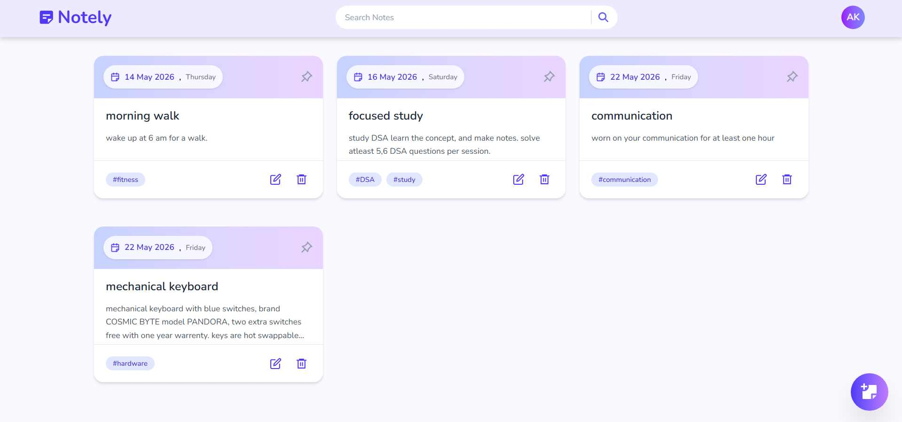
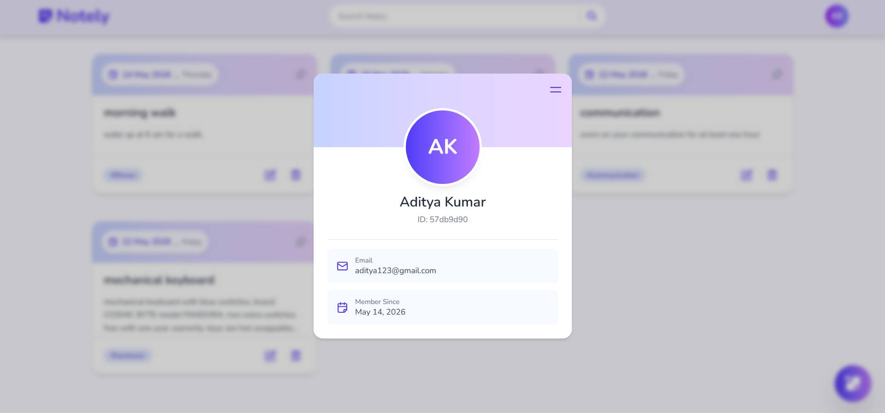
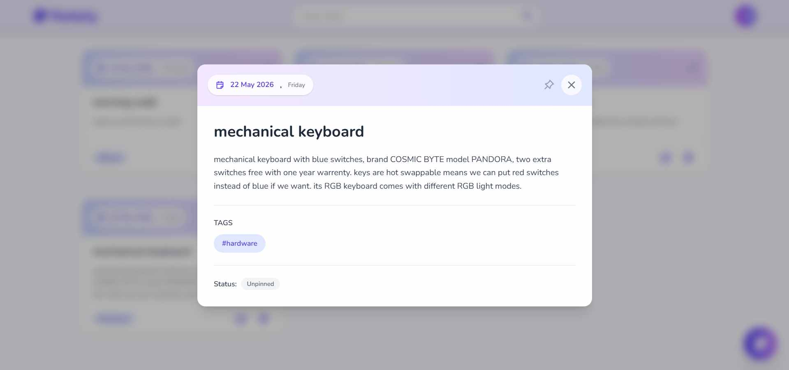

# Notely

A full-stack MERN notes application with secure JWT authentication, note management, pinning functionality, and responsive UI.  
Built as a project-based learning application to strengthen full-stack development skills using the MERN stack and MVC backend architecture.

---

## Live Demo

[note-app-five-lilac.vercel.app](https://note-app-five-lilac.vercel.app/)

---

## Screenshots

### Home Page

### Profile Page

### Note Dialog Box

---

## Features

- JWT-based Authentication
- User Signup & Login System
- Create, Read, Update, Delete Notes
- Pin Important Notes
- Search Notes Functionality
- Fully Responsive Design
- Individual User Profile Page
- Secure Protected Routes
- View Full Note Content in Dialog Box
- MVC Backend Architecture
- REST API Integration

---

## Tech Stack

### Frontend
- React.js
- Tailwind CSS
- Axios
- React Router DOM

### Backend
- Node.js
- Express.js

### Database
- MongoDB
- Mongoose

### Authentication
- JWT (JSON Web Token)

### Deployment
- Vercel (Frontend)
- Render (Backend)

---

## What I Learned

This project helped me improve my understanding of:

- Full-stack MERN development
- JWT authentication flow
- REST API creation
- MongoDB database operations
- MVC backend architecture
- State and data management
- Frontend and backend deployment
- Responsive UI development using Tailwind CSS
